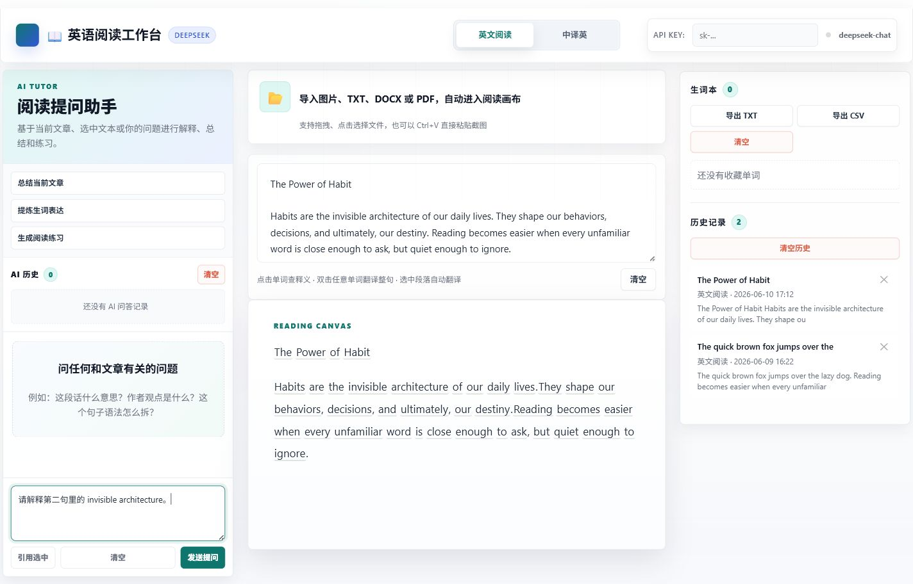
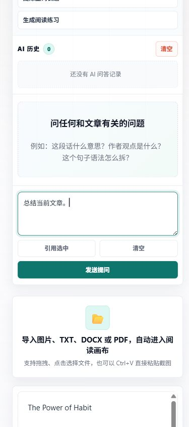

# English Reading Assistant 英语阅读工作台

一个纯前端的 AI 阅读与翻译工作台。它把英文精读、中译英、AI Tutor、查词翻译、朗读辅助、生词本、阅读历史和 AI 问答历史放在同一个单页里。

<p align="center">
  <strong>🤖 AI Tutor · 📖 英文精读 · 🌐 中译英 · 🔊 朗读辅助 · 📚 学习记录</strong>
</p>


## 🖼️ 界面预览

### 💻 桌面端



### 📱 移动端



## ✨ 这次更新新增了什么

| 新功能 | 说明 |
| --- | --- |
| 🤖 AI Tutor 侧栏 | 基于当前文章、选中文本和你的问题进行解释、总结、语法拆解和学习建议 |
| ⚡ 快捷学习任务 | 一键总结当前文章、提炼生词表达、生成 CET-4 风格阅读练习 |
| ✂️ 引用选中 | 选中文章或输入框里的句段后，一键带入 AI 提问框 |
| 🕘 AI 问答历史 | 自动保存最近 AI 问答，可回看、删除或清空 |
| 🔊 朗读辅助 | 单词释义弹窗和选中英文文本支持浏览器朗读 |
| 🎨 工作台式布局 | 左侧 AI Tutor、中间阅读画布、右侧生词本/历史记录，阅读和提问可以并行 |

## 🎯 适合做什么

| 场景 | 你可以这样用 |
| --- | --- |
| 📖 英文精读 | 粘贴英文文章，点击单词查释义，双击翻译整句 |
| 🤖 文章讲解 | 让 AI Tutor 总结文章、解释难句、梳理作者观点 |
| 📝 阅读练习 | 一键生成选择题和答案解析，用来复习文章 |
| 🌐 中文转英文 | 切换到中译英模式，查询中文词语对应英文表达 |
| 🖼️ 处理文件 | 导入图片、TXT、DOCX、PDF，或直接粘贴截图做 OCR |
| 📚 积累复习 | 收藏生词，导出 TXT / CSV，并保留阅读和 AI 问答历史 |

## 🧭 功能流程

```text
📂 导入/粘贴内容
        ↓
📖 阅读画布自动排版
        ↓
🔍 点击查词 / 🌐 翻译句段 / 🔊 朗读英文
        ↓
🤖 AI Tutor 总结、解释、出题
        ↓
📚 生词本 + 阅读历史 + AI 问答历史本地保存
```

## 🚀 快速开始

1. 下载仓库中的 `English Reading Assistant.html`。
2. 双击该文件，用浏览器打开。
3. 在右上角 `API Key` 输入框填入 DeepSeek API Key。
4. 选择“英文阅读”或“中译英”，粘贴文本或导入文件。
5. 在左侧 AI Tutor 中输入问题，或点击快捷任务开始学习。

> 查词、翻译和 AI Tutor 需要网络连接，并会调用 DeepSeek API。生词本、阅读历史、AI 问答历史和 API Key 保存在浏览器 localStorage 中。

## 🔑 API Key 配置

1. 打开 [DeepSeek Platform](https://platform.deepseek.com/) 并登录。
2. 在 API Keys 页面创建一个以 `sk-` 开头的 Key。
3. 将 Key 粘贴到页面右上角的输入框。
4. 状态点变为绿色后即可开始查词、翻译和提问。

API Key 只保存在当前浏览器本地。不要在公共电脑上长期保存自己的 Key。

## 🤖 AI Tutor 使用方式

- 输入问题后点击“发送提问”，或使用 `Ctrl + Enter` 发送。
- 点击“总结当前文章”：让 AI 提炼文章核心内容。
- 点击“提炼生词表达”：找出值得学习的词汇和表达。
- 点击“生成阅读练习”：生成英文阅读理解题和中文解析。
- 选中文章片段后点击“引用选中”：让 AI 针对这一句或这一段解释。
- AI 历史会保存最近 30 条问答，方便回看。

## 📖 英文阅读模式

1. 将英文文章粘贴到输入框，或通过上传区域导入文件。
2. 页面会自动把文章渲染成可交互段落。
3. 点击单词：查询音标和中文释义。
4. 双击任意单词：翻译该单词所在整句。
5. 选中一段英文：自动翻译选中文本，并可朗读英文。
6. 在释义弹窗中点击“收藏”：加入右侧生词本。

## 🌐 中译英模式

1. 切换到“中译英”标签。
2. 粘贴中文文章。
3. 双击词语：查询对应英文表达。
4. 三击句子：翻译整句为自然英文。
5. 选中一段中文：翻译选中文本。

该模式适合写作、表达替换和把中文材料快速转换成英文参考。

## 📂 文件导入

上传区域支持以下方式：

| 方式 | 说明 |
| --- | --- |
| 拖拽文件 | 将文件拖入上传区域 |
| 点击上传 | 点击上传区域选择本地文件 |
| 粘贴截图 | 使用 `Ctrl+V` 直接粘贴截图 |
| 手动粘贴 | 将文本复制到输入框 |

支持格式：

| 格式 | 处理方式 |
| --- | --- |
| TXT | 直接读取纯文本 |
| DOCX | 使用 mammoth.js 提取文档文本 |
| PDF | 使用 pdf.js 逐页提取文字 |
| PNG/JPG/WebP | 使用 Tesseract.js 识别图片文字 |

## 📚 学习记录

| 记录 | 能做什么 |
| --- | --- |
| 生词本 | 收藏单词，回看释义，导出 TXT / CSV |
| 阅读历史 | 自动保存最近阅读内容，点击即可恢复 |
| AI 问答历史 | 保存 AI Tutor 问答，支持回看、删除和清空 |

## 💡 使用小贴士

| 小技巧 | 说明 |
| --- | --- |
| ⭐ 先读后问 | 先读一段，再让 AI Tutor 总结或解释难句，学习效果更稳 |
| ✂️ 善用引用 | 对某个句子困惑时，选中它再点“引用选中” |
| 🔊 听读结合 | 查词后点朗读，顺手熟悉发音 |
| 📚 少量收藏 | 只收藏真正想复习的词，导出的词表会更干净 |

## ❓ 常见问题

### 这是单文件网页吗？

是。核心代码都在 `English Reading Assistant.html` 中，不需要安装或构建。

### 为什么查词、翻译或 AI 提问失败？

常见原因包括：没有填写 API Key、Key 无效、账户余额不足、网络无法访问 DeepSeek API，或浏览器拦截了请求。

### API Key 会上传到第三方服务器吗？

页面只会把 Key 用于请求 DeepSeek API。Key 保存在浏览器 localStorage 中，本项目没有后端服务器。

### 能离线使用吗？

不能完全离线。AI 查词、翻译和 AI Tutor 需要 DeepSeek API；OCR、PDF、DOCX 等前端库首次加载也需要联网。

### 支持手机吗？

支持。页面已做响应式布局，手机上会把 AI Tutor、阅读区和记录区上下排列。

## 🛠️ 技术栈

- HTML5
- CSS3
- JavaScript
- DeepSeek Chat Completions API
- Web Speech API
- Tesseract.js
- pdf.js
- mammoth.js
- localStorage

## 📁 文件结构

```text
English-Reading-Assistant/
├─ assets/
│  ├─ overview.png
│  ├─ screenshot-desktop.png
│  └─ screenshot-mobile.png
├─ English Reading Assistant.html
└─ README.md
```

## 📄 许可

MIT License
